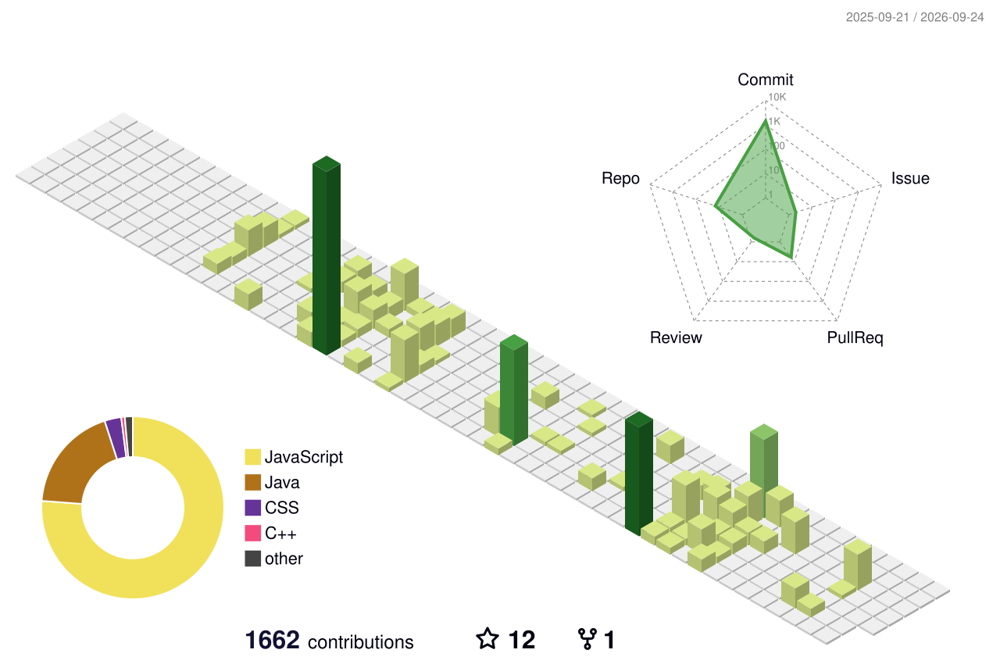

# Het Solanki

### Software Engineer - Full-Stack Developer

Building practical, maintainable software and continuously learning how to design
reliable systems.

<a href="https://linkedin.com/in/hetsolanki">LinkedIn</a> |
<a href="https://stackoverflow.com/users/31159824">Stack Overflow</a> |
<a href="https://www.leetcode.com/het_solanki">LeetCode</a> |
<a href="mailto:hetps2122004@gmail.com">Email</a>

---

## About me

- Currently learning **system design** and **network security**
- Interested in full-stack applications, backend engineering, and developer tooling
- Building and sharing projects on my [portfolio](https://portfolio-omega-liard-v3gb110b4q.vercel.app/)
- Enjoy solving problems, exploring new technologies, and improving code quality

## Tech stack

  

## GitHub activity

  
  

## Contribution graph

The contribution animation is generated automatically by the
[`snake.yml`](.github/workflows/snake.yml) workflow.

  <picture>
    <source media="(prefers-color-scheme: dark)" srcset="https://raw.githubusercontent.com/Het-2004/Het-2004/output/github-contribution-grid-snake-dark.svg">
    <source media="(prefers-color-scheme: light)" srcset="https://raw.githubusercontent.com/Het-2004/Het-2004/output/github-contribution-grid-snake.svg">
    
  </picture>

## 3D contribution profile

Generated views are maintained by the
[`3d-contrib.yml`](.github/workflows/3d-contrib.yml) workflow.

  

## Let's connect

I'm open to connecting with developers, recruiters, and teams working on thoughtful
software products.

- **Email:** [hetps2122004@gmail.com](mailto:hetps2122004@gmail.com)
- **LinkedIn:** [linkedin.com/in/hetsolanki](https://linkedin.com/in/hetsolanki)
- **Stack Overflow:** [stackoverflow.com/users/31159824](https://stackoverflow.com/users/31159824)
- **LeetCode:** [leetcode.com/het_solanki](https://www.leetcode.com/het_solanki)

  Thanks for visiting - feel free to explore my repositories.

